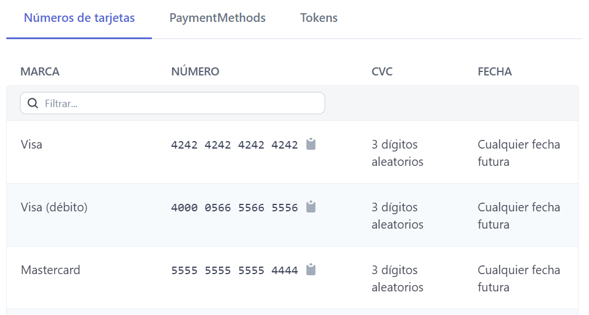

# Client Project README

## Project Name: client

- **Private**: true
- **Version**: 0.0.0
- **Type**: module

### Scripts

1. **dev**: Start the Vite development server.
2. **build**: Build the project using Vite.
3. **lint**: Run ESLint for linting with specific configurations.
4. **preview**: Start a Vite preview server.

### Dependencies

- axios: ^1.5.0
- js-cookie: ^3.0.5
- react: ^18.2.0
- react-dom: ^18.2.0
- react-hook-form: ^7.46.1
- react-router-dom: ^6.15.0

### Development Dependencies

- @types/react: ^18.2.15
- @types/react-dom: ^18.2.7
- @vitejs/plugin-react: ^4.0.3
- eslint: ^8.45.0
- eslint-plugin-react: ^7.32.2
- eslint-plugin-react-hooks: ^4.6.0
- eslint-plugin-react-refresh: ^0.4.3
- vite: ^4.4.5

## Admin Role Authorization

In this application, an administrator role can be created from the backend. This role is granted certain privileges and access to specific routes within the system. For practical purposes, a test user has been created to demonstrate the functionality of the administrator role.

### Test User Information

- Email: [admin@example.com]
- Password: [123456]

-Email: [usuario1@demo.com]
-Password: [123456]

-test cards

